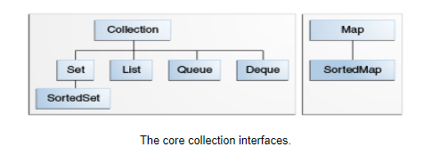

= Good to know about Collection:

https://docs.oracle.com/javase/tutorial/collections/interfaces/

Cannot see on diagram, but Collection also includes tree set, because that implement sorted set (as visible above)! but in this case:

wrong Collection<E> collections = new TreeSet<>(); <- gives error! (ClassCastException)

Correct: TreeSet<Seat> seats = new TreeSet<>(); or SortedSet<Seat> seats = new TreeSet<>();